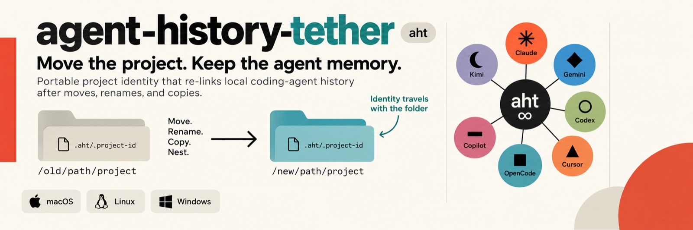

# agent-history-tether  (`aht`)

> **Move a project folder and your AI coding agents forget everything about
> it.**  Claude Code, Codex, Gemini, Cursor and friends each keep per-project
> conversation history keyed to the folder's *absolute path* — as an encoded
> directory name, a path hash, or a cwd recorded inside session files.  Rename,
> move, nest or copy the folder and the agent silently starts from zero; the
> history is still on disk, but orphaned, with no built-in way to reattach it.
>
> **aht fixes that for all of them at once.**  One tiny identity marker travels
> with each folder; one background watcher (plus Claude Code's SessionStart
> hook as a backstop) notices moves, renames and copies and re-links every
> agent's history — asking first, by default.  It also auto-backs-up all
> histories, restores them wherever a folder ends up, and badges managed
> folders.  History is never deleted or overwritten.

## Supported agents

| backend | agent CLI | storage model | relink | confidence |
|---|---|---|---|---|
| `claude` | Claude Code | `~/.claude/projects/<encoded-path>` | rename dir | **verified** (+ SessionStart hook backstop) |
| `gemini` | Gemini CLI | `~/.gemini/tmp/<sha256(path)>` | rename dir | high |
| `cursor` | Cursor Agent CLI | `~/.cursor/chats/<hash(path)>` | rename dir | best-effort |
| `opencode` | OpenCode | `$XDG_DATA_HOME/opencode/project/<enc>` | rename dir | best-effort |
| `codex` | OpenAI Codex CLI | `~/.codex/sessions/**/*.jsonl` (cwd inside) | rewrite cwd, **backup-first** | high (layout confirmed on a real install) |
| `copilot` | GitHub Copilot CLI | `~/.copilot/history-session-state/**` | rewrite cwd, **backup-first** | best-effort |
| `kimi` | Kimi Code | `~/.kimi/sessions/<md5(path)>` (+ `user-history/<md5>.jsonl` companion) | rename dir + companion | **verified** (mapped from a real install) |

**Why "best-effort" is still safe:** dir-rename backends are *self-verifying* —
aht only acts when `key(old_path)` names a directory that actually exists,
which proves the key formula matches that tool's reality; otherwise it does
nothing.  Metadata-rewrite backends copy every file they are about to touch
into the backup store first.  Disable any backend with
`aht config --set backends=claude,gemini,…`.

## Install

**Prebuilt** — from the
[releases page](https://github.com/havurgiray/agent-history-tether/releases)
or a package manager:

| platform | how |
|---|---|
| **macOS 13+** (Apple Silicon and Intel) | `brew install --cask havurgiray/tap/aht` then `aht install` — or download `aht-<version>-macos-universal.zip`, drag `aht.app` to Applications, open it and accept *Set Up aht on This Mac* (first launch: see the note on unsigned builds below).  The app **is** the menu bar tray (look for the ∞ icon) and carries the core, the FSEvents watcher and the badge tool prebuilt, so no compiler is needed |
| **Windows 11** (x64 and ARM64) | `scoop bucket add havurgiray https://github.com/havurgiray/scoop-bucket` then `scoop install aht` — or `winget install havurgiray.aht` — or download the zip for your CPU; then `aht install` (registers the logon watcher + hook; `aht-tray.exe` is the tray) |
| **Linux** | from a checkout: `cd linux && ./install.sh` (systemd user watcher + hook + `aht`); tray: `python3 linux/tray.py` (needs PyGObject + AppIndicator; GNOME also needs the AppIndicator shell extension) |

**From source** (needs Python 3.9+): clone the repo, then `./install.sh` on
macOS (compiles the Swift watcher, badge tool and tray — needs the Xcode
Command Line Tools), `cd linux && ./install.sh` on Linux, or build the exes
on Windows (`windows\build_windows.bat`; or `windows/build.sh` via
Docker+Wine from macOS/Linux) and run `aht.exe install`.

> **Unsigned builds.**  The macOS app is ad-hoc signed (no Apple Developer
> ID yet), so Gatekeeper blocks the first launch of a downloaded *or*
> Homebrew-installed copy ("Apple could not verify…"): allow it once under
> *System Settings ▸ Privacy & Security ▸ Open Anyway*, or clear the flag
> with `xattr -dr com.apple.quarantine /Applications/aht.app`.  The Windows
> exes are unsigned, so SmartScreen shows "unknown publisher" on first run
> (*More info ▸ Run anyway*).  Every release ships `SHA256SUMS.txt`, and
> every artifact is built and smoke-tested on GitHub's runners for its exact
> platform before it is published.

Then, everywhere:

```sh
aht adopt --apply     # tether this machine's existing projects (store-corroborated, add-only)
aht status            # which agents were detected, what's tracked
aht doctor            # check every piece
```

> **Already using another folder-tethering tool?**  Run only ONE watcher/hook
> set at a time, or you'll get doubled prompts.  Legacy `.claude/.project-id`
> markers are read automatically, so previously tagged folders carry straight
> over via `aht adopt --apply`.

## Pause or uninstall

**Pause watching** (temporary — no uninstall needed): every tray has *Pause
Watching*; resume the same way.  While paused, the Claude SessionStart hook
still protects any project you open.

**Uninstall** removes the watcher, the hook, the tray autostart and the `aht`
command.  No agent's history is EVER touched by uninstalling:

| platform | command |
|---|---|
| macOS | `aht uninstall` (or `./uninstall.sh` from a checkout); then drag `aht.app` to the Trash, or `brew uninstall --cask aht` |
| Linux | `cd linux && ./uninstall.sh` |
| Windows | `aht uninstall` |

Optional flags (macOS/Windows; Linux clears emblems via the tray's *Clear all
emblems* instead):

- `--remove-icons` — also clear the folder badges aht applied
- `--purge` — also remove the `.aht/.project-id` markers and aht's own
  registry/config under `~/.aht` (every agent's history still stays intact)

Leftovers by design: the histories themselves, backups under `~/.aht/backups`
(delete by hand if unwanted), and on Windows the exe files (delete them
yourself — a running exe can't remove itself).

## How it works

- **Marker**: `.aht/.project-id` (a UUID) travels with the folder on
  move/copy — that's the identity every backend's history is tethered to.
- **Registry**: `~/.aht/registry.json` maps `uuid → {real_path, per-backend
  stores}`.
- **Watcher**: FSEvents (macOS) / inotify+polling (Linux) /
  `FindFirstChangeNotificationW` (Windows) over the configured roots; on a
  debounced change it detects moves/renames/copies and asks to relink
  (policies configurable: ask / auto / never / ignore).
- **Hook**: Claude Code is the only agent CLI with hooks, so its SessionStart
  hook doubles as the guaranteed backstop — opening Claude in a moved folder
  relinks *every* backend, even moves the watcher missed.
- **Backups**: every project's histories (all backends, one zip) are
  auto-snapshotted (`backup_enabled`, `backup_interval_hours`, `backup_keep`,
  `backup_dir`); `aht restore <folder> --apply` reconnects a folder to a
  snapshot wherever it now lives — via its marker, or evidence-ranked matching
  when even the marker is gone.  Restored Codex/Copilot sessions get their cwd
  re-pointed at the new path.
- **Badges — one symbol per agent**: a folder opened in several CLIs shows
  which ones.  Each agent gets a white-ringed disc in its own color with a
  distinct glyph — claude coral ✳, gemini blue ◆, codex teal ○, cursor black
  ▲, opencode orange ■, copilot purple ▬, kimi violet ☾.  **1 agent** → one
  full-size disc (lower right); **2** → two smaller, side by side; **3** →
  three smaller still; **4 or more** → a single slate disc showing the
  *count*.  The git "+" (center) is independent and unaffected.  Rendered as
  composited folder icons on macOS/Windows (the icon files live inside the
  folder, so they travel with it) and as generated per-agent emblems on Linux
  (installed into the user icon theme; ≤3 emblems, a count emblem for 4+ —
  KDE's `.directory` fallback can show only one icon).

## Settings

One shared config (`~/.aht/config.json`) read by the CLI, the watchers, the
hook and all three trays — set with `aht config --set k=v`:

`watch_roots`, `backends`, `backend_roots` (where each CLI's store lives,
for installs not found automatically — set with `aht backends --set-root
name=/path`, or point-and-click via every tray's *Settings ▸ Agent CLI
Locations* page), `move_policy`, `copy_policy`, `new_policy`,
`notifications`, `icons_enabled` / `icons_agent` / `icons_git`,
`debounce_seconds`, `scan_max_depth`, `extra_prune_dirs`, `dialog_timeout`,
`watcher_owner`, `log_level`, `backup_enabled` / `backup_interval_hours` / `backup_keep` /
`backup_dir`, `linux_emblem_method` / `linux_agent_emblem` / `linux_git_emblem`.

Every platform has a tray with the same menu (status, reconcile now,
pause/resume watching, recent projects, adopt with confirmation, the policy /
notification / backup switches, badge controls, diagnostics, autostart
toggle), shown as an ∞ icon in the bar: `aht.app` (or the tray compiled by
`install.sh`) on macOS, `aht-tray.exe` on Windows, `linux/tray.py` on Linux.

## Safety invariants

1. History is **never deleted or overwritten** — dir renames refuse occupied
   targets (surfaced as conflicts, never merged); metadata rewrites are
   preceded by a mandatory backup copy; restores only add missing files.
2. Adoption is **add-only** and store-corroborated (a backend's store must
   provably exist for the folder's exact path).
3. All registry writes happen under one lock, never held across a dialog;
   folder swaps resolve via two-phase staging per backend.
4. A prompt that cannot be shown (headless) always means **change nothing**.

## Commands

`status` · `doctor` · `adopt` · `reconcile` · `projects` · `orphans --match` ·
`suggest-matches` · `bind` · `prune` · `forget` · `backup` / `backup --list` /
`restore` · `backends [--set-root]` ·
`config` · `roots` / `reload` · `icons --refresh` · `logs [--errors]`
(leveled `[WARN]`/`[ERROR]` lines, size-rotated at `~/.aht/aht.log`) ·
`tag` · `keys <path>`
(each backend's store key for a path) · `encode` · `hook` · `version`.
Run `aht` with no arguments for the full help screen; every `--json` output is
a stable machine interface (it's what the trays use).

## Tests

```sh
tests/run_tests.sh        # multi-backend core + Linux layer (any OS, fake stores)
windows/build.sh          # builds the exes, then runs the smoke suites under wine
macos/build_app.sh --test # builds aht.app, then runs the tray's headless selftest
```

The suites fake every agent's store via `AHT_ROOT_*` env overrides, so they
never touch real agent data.  GitHub Actions runs the core suites (Linux and
macOS, Python 3.9 and 3.12), builds the app bundle, and builds and
smoke-tests the Windows exe natively on every push; tagging `vX.Y.Z` builds
the release artifacts (Windows x64 and ARM64 on native runners, the universal
macOS app) and publishes them with checksums.  Honest limits: the
Cursor/OpenCode/Copilot layouts are implemented from best-effort knowledge and
self-verify at runtime (they no-op rather than guess); the tray UIs need a
real desktop of each OS for full exercise.

## License

Copyright (C) 2026 Giray Havur

This program is free software: you can redistribute it and/or modify it
under the terms of the [GNU Affero General Public License](LICENSE) as
published by the Free Software Foundation, either version 3 of the
License, or (at your option) any later version.  It is distributed in
the hope that it will be useful, but WITHOUT ANY WARRANTY; without even
the implied warranty of MERCHANTABILITY or FITNESS FOR A PARTICULAR
PURPOSE.  See the [license text](LICENSE) for details.

**Commercial licensing available — contact me.**  If the AGPL terms do
not fit how your organization wants to use or redistribute aht, write to
[agent.history.tether@gmail.com](mailto:agent.history.tether@gmail.com) for a commercial
license.
