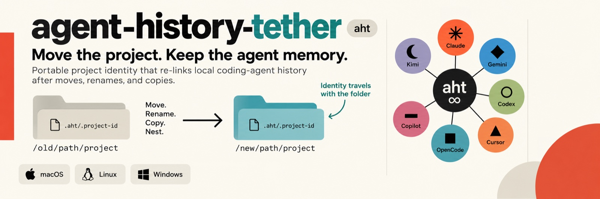
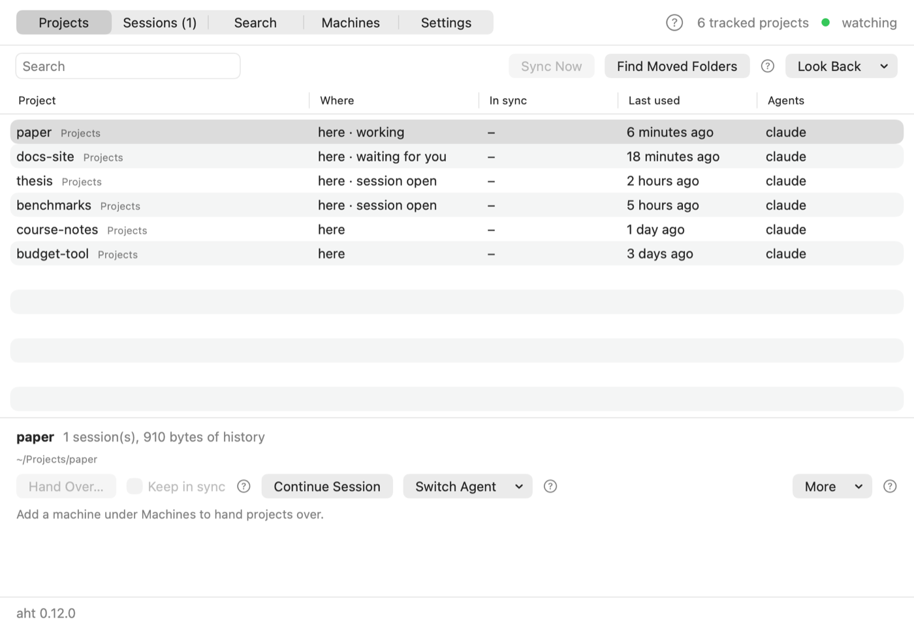
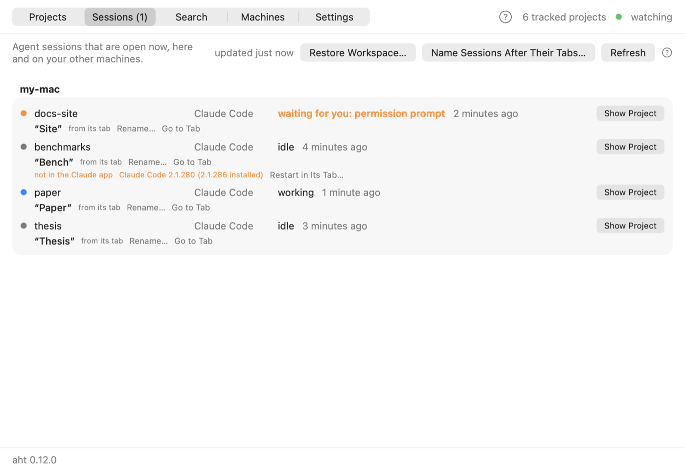
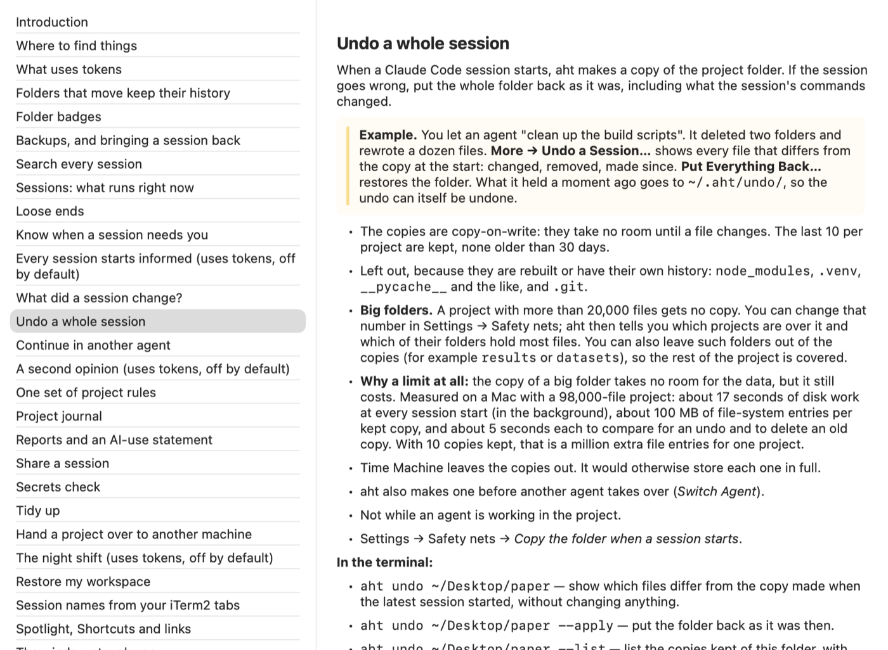

# agent-history-tether  (`aht`)

> **Move a project folder and your AI coding agents forget everything about
> it.**  Claude Code, Codex, Gemini, Cursor and friends each keep per-project
> conversation history keyed to the folder's *absolute path* — as an encoded
> directory name, a path hash, or a cwd recorded inside session files.  Rename,
> move, nest or copy the folder and the agent silently starts from zero; the
> history is still on disk, but orphaned, with no built-in way to reattach it.
>
> **aht fixes that for all of them at once.**  One tiny identity marker travels
> with each folder; one background watcher (plus Claude Code's SessionStart
> hook as a backstop) notices moves, renames and copies and re-links every
> agent's history — asking first, by default.  It also auto-backs-up all
> histories, restores them wherever a folder ends up, and badges managed
> folders.  History is never deleted or overwritten.

**New to aht?** The [guide](GUIDE.md) walks through every feature with an example, and lists every setting and every command, with what each does in plain words. It is also in the app (∞ → **Guide**, and a **?** next to each feature opens its section) and in the terminal (`aht guide`).

## The Mac app

On macOS, aht is an app: an ∞ in the menu bar and a window.  On Linux and
Windows it is a tray and the `aht` command (see *Platforms*).

<p>
<picture><source media="(prefers-color-scheme: dark)" srcset="docs/screenshots/mac-projects-dark.png"></picture>
<picture><source media="(prefers-color-scheme: dark)" srcset="docs/screenshots/mac-sessions-dark.png"></picture>
</p>

- **Projects** — every tracked folder: here or handed over, a session
  working or waiting for you, last used, which agents have history there.
  Select one to hand it over, keep it in sync, continue its session or
  switch agent; **More** has What Changed, Undo a Session, Journal,
  AI-Use Statement, Share, Project Rules, Secrets, Second Opinion and Night
  Shift.  **Look Back** has Loose Ends and the Report; **Tidy Up** appears
  when something needs a decision.
- **Sessions** — the open sessions here and on your other machines, each
  with the name the Claude app shows (taken from its iTerm2 tab), **Go to
  Tab**, and **Restart in Its Tab** for one that is outside the Claude app
  or on an older Claude Code; **Restore Workspace** brings the iTerm2 tabs
  and their sessions back after a restart.
- **Search**, **Machines** and **Settings** tabs; Finder Quick Actions,
  ⌃⌥⌘A, Spotlight, `aht://` links and notices you can click.
- A **?** next to every feature opens the [guide](GUIDE.md) at its section:

<p><picture><source media="(prefers-color-scheme: dark)" srcset="docs/screenshots/mac-guide-dark.png"></picture></p>

*The screenshots show made-up projects, in your page's light or dark look;
`docs/make_screenshots.py` renders them again.*

## Supported agents

| backend | agent CLI | storage model | relink | confidence |
|---|---|---|---|---|
| `claude` | Claude Code | `~/.claude/projects/<encoded-path>` | rename dir | **verified** (+ SessionStart hook backstop) |
| `gemini` | Gemini CLI | `~/.gemini/tmp/<sha256(path)>` | rename dir | high |
| `cursor` | Cursor Agent CLI | `~/.cursor/chats/<hash(path)>` | rename dir | best-effort |
| `opencode` | OpenCode | `$XDG_DATA_HOME/opencode/project/<enc>` | rename dir | best-effort |
| `codex` | OpenAI Codex CLI | `~/.codex/sessions/**/*.jsonl` (cwd inside) | rewrite cwd, **backup-first** | high (layout confirmed on a real install) |
| `copilot` | GitHub Copilot CLI | `~/.copilot/history-session-state/**` | rewrite cwd, **backup-first** | best-effort |
| `kimi-code` | Kimi Code 2.x | `~/.kimi-code/sessions/wd_<slug>_<sha256[:12]>` (+ prompt-history and file-history companions; the path is also recorded in each session's `state.json` and in the workspace catalog) | rename bucket + companions, re-point `cwd`, **backup-first** | **verified** (key function ported from the CLI's own source, layout mapped from a real install) |
| `kimi` | Kimi CLI 1.x | `~/.kimi/sessions/<md5(path)>` (+ `user-history/<md5>.jsonl` companion) | rename dir + companion | **verified** (mapped from a real install; kept for machines the 2.x migration has not reached) |

**Why "best-effort" is still safe:** dir-rename backends are *self-verifying* —
aht only acts when `key(old_path)` names a directory that actually exists,
which proves the key formula matches that tool's reality; otherwise it does
nothing.  Metadata-rewrite backends copy every file they are about to touch
into the backup store first.  Disable any backend with
`aht config --set backends=claude,gemini,…`.

Two backends can serve one agent: Kimi changed its store layout between
1.x and 2.x, so `kimi` and `kimi-code` both count as *Kimi* on badges and in
prompts.  For Kimi Code, aht renames the session bucket (that is how the
CLI finds sessions), re-points the `cwd` a resumed session would run in,
renames the workspace's catalog entry, and appends to the CLI's session log
instead of rewriting it.  Transcripts are never edited, and workspace
*trust* is deliberately not carried to the new location — Kimi asks again.

## Platforms

aht runs on macOS, Linux and Windows.  The core — keeping every agent's
history with its folder through moves and copies, backups, restore, badges,
the tray — works on all three.  Since 0.11, new features are built and
tested on macOS first: they reach Linux and Windows when they need nothing
that only macOS has (the window, iTerm2, APFS copy-on-write, a LaunchAgent)
and have been tested there.  Until then, many of them already work from the
terminal.

| feature | macOS | Linux | Windows |
|---|---|---|---|
| Moves, copies and relinks; backups and restore; badges; the tray | ✓ | ✓ | ✓ |
| The Claude Code hook (relinks when a session starts) | ✓ | ✓ | ✓ |
| Search, journal, report and AI-use statement, share, secrets check, project rules, loose ends, tidy | window and terminal | terminal | terminal |
| Switch agent | window and terminal | terminal | terminal, untested |
| Handover, keep in sync, backups on another machine | ✓ | terminal; also as the machine projects go to | — |
| Notices (waiting for you, done, usage limit) | every 30 s; a click goes to the session | `aht notices` from your own timer | — |
| Night shift | ✓ | needs `aht notices` on a timer | — |
| Undo a session (a copy of the folder when a session starts) | on: copy-on-write copies cost no room | off: real copies up to 100 MB once `checkpoints=true` | as Linux |
| Second opinion, informed sessions (use tokens; off by default) | window and terminal | terminal | untested |
| Session names from iTerm2 tabs, Go to Tab, workspace restore, restart in its tab, checkup | ✓ (iTerm2) | — | — |
| The window, Spotlight, `aht://` links, Finder Quick Actions, search shortcut, in-app guide | ✓ | — | — |

"terminal" means the `aht` command does it; the guide gives each one.  CI
runs the whole test suite on Linux and macOS for every push, and on real
Windows it smoke-tests the exe: moves and relinks, the watcher, backups,
and search, journal, report, share, secrets, rules, loose ends, undo and
tidy.  "untested" means the feature is in the Windows build but no test
has run it on Windows yet.

## Install

**Prebuilt** — from the
[releases page](https://github.com/havurgiray/agent-history-tether/releases)
or a package manager:

| platform | how |
|---|---|
| **macOS 13+** (Apple Silicon and Intel) | `brew install --cask havurgiray/tap/aht` then `aht install` — or download `aht-<version>-macos-universal.zip`, drag `aht.app` to Applications, open it and accept *Set Up aht on This Mac* (first launch: see the note on unsigned builds below).  The app **is** the menu bar tray (look for the ∞ icon) and carries the core, the FSEvents watcher and the badge tool prebuilt, so no compiler is needed |
| **Windows 11** (x64 and ARM64) | `scoop bucket add havurgiray https://github.com/havurgiray/scoop-bucket` then `scoop install aht` — or `winget install havurgiray.aht` — or download the zip for your CPU; then `aht install` (registers the logon watcher + hook; `aht-tray.exe` is the tray) |
| **Linux** | from a checkout: `cd linux && ./install.sh` (systemd user watcher + hook + `aht`); tray: `python3 linux/tray.py` (needs PyGObject + AppIndicator; GNOME also needs the AppIndicator shell extension) |

**From source** (needs Python 3.9+): clone the repo, then `./install.sh` on
macOS (compiles the Swift watcher, badge tool and tray — needs the Xcode
Command Line Tools), `cd linux && ./install.sh` on Linux, or build the exes
on Windows (`windows\build_windows.bat`; or `windows/build.sh` via
Docker+Wine from macOS/Linux) and run `aht.exe install`.

> **Unsigned builds.**  The macOS app is ad-hoc signed (no Apple Developer
> ID yet), so Gatekeeper blocks the first launch of a downloaded *or*
> Homebrew-installed copy ("Apple could not verify…"): allow it once under
> *System Settings ▸ Privacy & Security ▸ Open Anyway*, or clear the flag
> with `xattr -dr com.apple.quarantine /Applications/aht.app`.  (macOS also
> stamps that flag on the helper copies the app installs under `~/.aht`;
> the installer clears it from those copies, and `aht doctor` checks that
> the badge tool really runs.)  After an upgrade, run `aht install` again so
> the watcher and the hook use the new core.  The Windows
> exes are unsigned, so SmartScreen shows "unknown publisher" on first run
> (*More info ▸ Run anyway*).  Every release ships `SHA256SUMS.txt`, and
> every artifact is built and smoke-tested on GitHub's runners for its exact
> platform before it is published.

Then, everywhere:

```sh
aht adopt --apply     # tether this machine's existing projects (store-corroborated, add-only)
aht status            # which agents were detected, what's tracked
aht doctor            # check every piece
```

> **Already using another folder-tethering tool?**  Run only ONE watcher/hook
> set at a time, or you'll get doubled prompts.  Legacy `.claude/.project-id`
> markers are read automatically, so previously tagged folders carry straight
> over via `aht adopt --apply`.

## Pause or uninstall

**Pause watching** (temporary — no uninstall needed): every tray has *Pause
Watching*; resume the same way.  While paused, the Claude SessionStart hook
still protects any project you open.

**Uninstall** removes the watcher, the hook, the tray autostart and the `aht`
command.  No agent's history is EVER touched by uninstalling:

| platform | command |
|---|---|
| macOS | `aht uninstall` (or `./uninstall.sh` from a checkout); then drag `aht.app` to the Trash, or `brew uninstall --cask aht` |
| Linux | `cd linux && ./uninstall.sh` |
| Windows | `aht uninstall` |

Optional flags (macOS/Windows; Linux clears emblems via the tray's *Clear all
emblems* instead):

- `--remove-icons` — also clear the folder badges aht applied
- `--purge` — also remove the `.aht/.project-id` markers and aht's own
  registry/config under `~/.aht` (every agent's history still stays intact)

Leftovers by design: the histories themselves, backups under `~/.aht/backups`
(delete by hand if unwanted), and on Windows the exe files (delete them
yourself — a running exe can't remove itself).

## How it works

- **Marker**: `.aht/.project-id` (a UUID) travels with the folder on
  move/copy — that's the identity every backend's history is tethered to.
- **Registry**: `~/.aht/registry.json` maps `uuid → {real_path, per-backend
  stores}`.
- **Watcher**: FSEvents (macOS) / inotify+polling (Linux) /
  `FindFirstChangeNotificationW` (Windows) over the configured roots; on a
  debounced change it detects moves/renames/copies and asks to relink
  (policies configurable: ask / auto / never / ignore).
- **Hook**: Claude Code is the only agent CLI with hooks, so its SessionStart
  hook doubles as the guaranteed backstop — opening Claude in a moved folder
  relinks *every* backend, even moves the watcher missed.
- **Backups**: every project's histories (all backends, one zip) are
  auto-snapshotted (`backup_enabled`, `backup_interval_hours`, `backup_keep`,
  `backup_dir`); `aht restore <folder> --apply` reconnects a folder to a
  snapshot wherever it now lives — via its marker, or evidence-ranked matching
  when even the marker is gone.  Restored Codex/Copilot sessions get their cwd
  re-pointed at the new path.
- **Badges — one symbol per agent**: a folder opened in several CLIs shows
  which ones.  Each agent gets a white-ringed disc in its own color with a
  distinct glyph — claude coral ✳, gemini blue ◆, codex teal ○, cursor black
  ▲, opencode orange ■, copilot purple ▬, kimi violet ☾.  A tethered folder
  no agent has history in yet shows a grey ∞ instead.  Badges follow reality:
  the agent list is re-checked on every watcher pass, Claude session start
  and `aht icons --refresh`, so an agent first used long after a folder was
  tethered still gets its disc.  **1 agent** → one
  full-size disc (lower right); **2** → two smaller, side by side; **3** →
  three smaller still; **4 or more** → a single slate disc showing the
  *count*.  The git "+" (center) is independent and unaffected.  Rendered as
  composited folder icons on macOS/Windows (the icon files live inside the
  folder, so they travel with it) and as generated per-agent emblems on Linux
  (installed into the user icon theme; ≤3 emblems, a count emblem for 4+ —
  KDE's `.directory` fallback can show only one icon).

## Handover: continue on another machine

Hand a project to another machine of yours — say an always-on box at home —
keep working on it there over ssh or from your phone, and take it back later.
The files, the agent's history and the session itself move; nothing is
installed on the other machine but what it needs anyway (python3, rsync 3,
tmux or byobu, the agent CLI).  macOS and Linux, Claude Code sessions for now.

```sh
aht remote discover                      # machines of your network that qualify
aht remote add homebox you@homebox       # ssh must work without a prompt
aht remote check                         # what it still lacks, with the fix
aht mirror ~/Desktop/paper --on          # optional: keep its copy there warm
aht handover ~/Desktop/paper             # dry run: what would travel
aht handover ~/Desktop/paper --apply     # send it, resume the session there
aht attach ~/Desktop/paper               # open that session
aht reclaim ~/Desktop/paper --apply      # bring files and history back
```

On macOS the same is in the app's window (**∞ ▸ Open aht…**): pick a project
in the list, then *Hand Over*, *Take Back*, *Open Session* or *Keep in sync*;
the list shows where each project is, when it was synced and whether an agent
session is open in it, and a transfer shows its progress.

- **Any number of machines.**  `aht remote discover` lists the computers of
  your Tailscale network and the hosts in `~/.ssh/config`; add as many as you
  like, pick one per handover with `--to <name>` (the tray: *Machine*), and
  `aht remote default <name>` sets the one used when none is named.  A
  project remembers where it went, so taking it back needs no name.

- **Same path on both sides.**  Agent CLIs key their history on the project's
  absolute path, so `/Users/you/Desktop/paper` must exist under that very
  path on the other machine — as a real folder, not a link.  On Linux, create
  it once: `sudo mkdir -p /Users/you && sudo chown $USER /Users/you`; on a
  machine other people use too, add `chmod 700 /Users/you` (`aht remote
  check` tells you when that is missing).
- **Nothing moves while something runs.**  An open agent session blocks the
  transfer, working or idle, and no flag overrides that: exit it first.  So
  does a background shell the session started, or any other program whose
  working directory is inside the project (`--allow-processes` leaves those
  behind).  On the way back the same holds for the other machine;
  `reclaim --stop` ends a session there only if it is idle.
- **Keep in Sync** copies a project in the background (every
  `mirror_interval_minutes`) while the connection is good, so the handover
  itself only sends the last changes.  Transfers are compressed (`rsync -z`).
- **What travels**: the folder, the history store, the `/rewind` checkpoints
  and, with `--include <path>`, files and folders outside the project
  (remembered per project).  **What stays**: `node_modules`, `.venv`,
  `__pycache__` and the like (rebuilt per machine), Finder's icon files,
  temporary files, running processes.
- **What the session knew travels in readable form too.**  A summary is
  written to `.aht/handover/` — the last compaction, the latest exchanges,
  open to-dos, the files it changed, the outside files it used — and the
  resumed session is told on arrival that it changed machines, what did not
  come along and where that summary is.  That folder carries its own
  `.gitignore`, so excerpts of a conversation never land in a commit.
- **The way back is three-way.**  Changes made there arrive; what changed
  only here stays; what changed on *both* sides is kept in both versions
  (`--prefer there` takes the other machine's instead).  Whatever a transfer
  replaces or removes is set aside in `~/.aht/handover/<id>/replaced/` first.
  A transcript only comes back if it *continues* the one that left.
- **Which session goes on.**  The one you worked in last, picked the way
  `claude --continue` picks it (scripted `claude -p` runs and `/loop`
  sessions do not count) — in both directions.  If that is not the session
  you handed over, because you branched or began another one over there,
  aht says so and offers both (`aht resume-here --handed-over`).
  `handover --session <id>` names one yourself.
- **Same agent version on both sides.**  The handover installs this
  machine's Claude Code version over there and keeps it from updating
  itself.  The way back is refused if the other machine — or anything that
  wrote into the returning history — used a newer version than this machine
  has: update here first (`--ignore-version` overrides).
- **A connection that survives the road.**  With mosh on both machines and
  its UDP ports open, `aht attach` uses it: the terminal stays connected
  through network changes and sleep.  aht tests the path once per machine
  (`aht remote check` tests again) and uses ssh when it is blocked.
- The folder shows a blue → badge while it is away, and a session started in
  it meanwhile is warned.  With `handover_remote_control` (default on) the
  session there is reachable from the Claude app, including permission
  prompts.

## Across agents

aht reads the sessions of Claude Code, Kimi Code and Codex, so it can work
across them.  On macOS all of this is in the app's window; the commands
behave the same.

- **Search everything** — `aht search <words>` (the window's *Search* tab)
  looks through every session of every agent and project, including
  sessions that were deleted since and live on only in a history backup; a
  hit offers to resume it, or to restore it first.  The index
  (`~/.aht/search.db`) keeps itself up to date and holds no keys: whatever
  looks like one is masked before it is stored.
- **Session board** — `aht board` (the *Sessions* tab) shows every open
  agent session on this Mac and on each machine set up for handover:
  working, waiting for you (and for what), or idle.  The menu bar counts
  the sessions waiting for you.
- **Switch agent** — `aht switch <folder> --to kimi|claude|codex --apply`
  continues a project's work in another agent: aht writes a summary of the
  latest session of the other agent into `.aht/handover/`, and the new agent
  reads it first, in a window of its own.  The earlier session stays as it
  was, so you can go back to it.
- **Hand over with a task** — `aht handover <folder> --apply --task "…"`
  (a field in the window's handover dialog): the session starts working on
  it the moment it has resumed on the other machine.
- **One set of project rules** — `aht rules <folder>` tells which
  instruction file each agent follows; `--unify --apply` makes `AGENTS.md`
  the one set of rules and reduces `CLAUDE.md` to `@AGENTS.md`, the import
  Claude Code documents for exactly this.  Two different files are merged
  only with `--prefer claude|agents|both`, and the earlier files are kept in
  `~/.aht/rules-backups/`.
- **Project journal** — `aht journal <folder>` builds a dated diary from all
  agents' sessions: what was asked, which files changed, how each day ended.
  `--write` keeps it as `.aht/journal/journal.md`.
- **Secrets check** — `aht secrets [folder]` lists what looks like a key, a
  token or a password in the agents' histories, masked, with where and when
  it appeared.  A handover says how many travel with the project.  aht never
  changes the histories themselves, and it masks such values in everything
  it writes: the search index, journals, and handover and switch summaries
  (those folders also carry a `.gitignore`).

- **Notices** — `aht notices` (run every 30 seconds by a LaunchAgent) tells
  you when a session, here or on another machine, starts waiting for you or
  finishes a long piece of work; optionally also on the phone
  (`notify_phone = imessage:<you>` or `ntfy:<topic>`).  With
  `session_corner` on, the app also lists this Mac's open Claude sessions
  in the screen's top-right corner: working, waiting for you, or done
  (until you click it, which goes to its tab, or it works again).
- **What changed** — `aht changes <folder> [--diff]`: every file a Claude
  Code session edited, before and now, from Claude's own checkpoints;
  `--revert <file> --apply` puts one back (the current one is kept aside).
- **Report and AI-use statement** — `aht report --since week --by
  project|agent|area` (areas: `report_areas` in the config); `--project …
  --statement` drafts a disclosure of AI use for a paper or a course.
- **Share** — `aht share <folder> --format html`: a session as a page without
  keys, e-mail addresses or local paths.
- **Tidy up** — `aht tidy`: gone folders and histories without a folder,
  with suggestions; `--relink <id> --to <folder> --apply`.
- **Backups elsewhere** — `offsite_backup = <machine>` copies the history
  backups there after each daily pass; `aht backup --fetch-offsite` brings
  them back on a new Mac.
- **Taking a key out** — `aht secrets --redact <fingerprint> --apply`
  replaces one found secret in every history file (copies kept first; not
  while a session is open there).
- **Finder and a shortcut** — right-click a project folder for aht's
  Quick Actions; ⌃⌥⌘A (`hotkey`) opens the search from anywhere.

## Before and after a session

- **Undo a whole session** — when a Claude Code session starts (and before
  another agent takes over), aht makes a copy-on-write copy of the project
  folder in `~/.aht/checkpoints/` (APFS clones: no room taken until a file
  changes; the last 10 per project; rebuilt folders and `.git` left out).
  `aht undo <folder>` shows what differs; `--apply` puts the folder back,
  including what the session's commands changed; what was there goes to
  `~/.aht/undo/` first.  `checkpoints = false` turns it off.  A project
  over `checkpoint_max_files` (20,000) gets no copy: a copy of 98,000 files
  measured 17 s of disk work per session start and ~100 MB of file-system
  entries per kept copy.  `aht checkpoint --coverage [--max N]` lists who is
  cut off and their biggest folders; `checkpoint_excludes` leaves folders
  out.  Time Machine is told to skip the copies (it would store them in
  full).
- **Claude's usage limit** — aht spots a session that stopped at the limit
  in its transcript (no tokens), says so in a notice with the reset time
  (`notify_limit`), and marks the project.  `aht limits` lists them.  With
  `limit_switch = true` it also offers to go on in `limit_switch_to` (Kimi
  Code by default) — that agent's tokens are used when you accept.
- **Informed sessions** — with `informed_sessions = true`, a new Claude Code
  session learns in a few lines where the last session in its folder
  stopped, whichever agent ran it (last request and answer, open to-dos,
  files changed; keys masked).
- **Loose ends** — `aht loose-ends`: projects of the last 30 days with work
  not committed, open to-do items, or a last session that ended on a
  question or an offer.
- **Second opinion** — `aht second-opinion <folder> --task "…"` runs Claude
  Code and Kimi Code on the same task, each in its own copy; `--show <id>`
  compares answers and changes, `--take <id> --from kimi --apply` brings one
  into the project (refused for files changed there meanwhile).  Needs
  `second_opinion = true`.
- **Night shift** — `aht night-shift <folder> --task "…" --start 22:00
  --back 07:00 --apply`: a handover with a task at the start time, taken
  back when the session is done after the end time (the notices agent keeps
  the clock; the Mac has to be awake).  Needs `night_shift = true`.
- **Session names from iTerm2 tabs** — `tab_names` (on): a Claude Code
  session is named after its iTerm2 tab's own title, which is what the
  Claude app (Remote Control), `/resume` and the prompt bar show.  Set by
  the SessionStart hook and, after a tab is renamed, at the next prompt
  (a UserPromptSubmit hook that asks iTerm2 for that one tab, about 0.2 s).
  Clashes among open sessions become `Paper · 2`, branches `Paper ⑂ 2`; a
  handed-over session is `Paper @ <machine>`.  The latest name wins both
  ways: a session renamed with `/rename`, in the app or in aht's window
  gives its tab the name, through iTerm2's Python API (switch it on in
  iTerm2 → Settings → General → Magic; with it off, the tab keeps its
  title).  `aht tab-names` lists them.
- **Workspace** — `aht workspace`: iTerm2's windows, tabs, titles, tab
  colours, profiles and the sessions in them are saved while you work
  (every `workspace_save_minutes` by the app, and on the prompt hook's
  background refresh; the last `workspace_keep` are kept);
  `--restore [--apply]` opens the layout from before iTerm2 last started
  again, starting iTerm2 if needed, each session resumed by id with its
  options.
- **Go to a tab, and a checkup** — `aht goto <project|session|pid>` brings a
  session's iTerm2 tab to the front; `aht checkup` marks sessions open
  twice, stuck, outside the Claude app or on an older Claude Code, and
  `--restart <pid> --apply` starts one again in its tab (`--close` ends it).
  A click on an aht notice goes to the session's tab (the app posts the
  notices; macOS used to attribute them to Script Editor).
- **Spotlight and links** — the app puts session titles into Spotlight
  (`spotlight`), and `aht://search?q=…`, `aht://loose-ends`,
  `aht://undo?path=…` and more open the window from the Shortcuts app or a
  script (see the guide); whatever starts an agent or changes files asks
  first.  `aht sessions --json` lists every session with its title.

### What uses tokens

aht's own work runs locally and never asks a model.  These are the only
features that make an agent read or work:

| Feature | What spends tokens | Default |
|---|---|---|
| Informed sessions (`informed_sessions`) | a few hundred tokens of context per new Claude Code session | off |
| Another agent at the usage limit (`limit_switch`) | the other agent reads a summary, when you accept | off |
| Second opinion (`second_opinion`) | both agents work on the task | off, and only when you press Start |
| Night shift (`night_shift`) | the agent on the other machine works on the task | off, and only the shifts you plan |
| Switch agent | the new agent reads a summary | only when you ask |
| Hand over with a task | the resumed session starts on the task | only when you give a task |
| Handover note | one sentence in a new Claude session while its project is away or just came back | part of handover |

Everything else — watching, relinking, badges, backups, search, the
session board, notices, loose ends, reports, journals, the secrets check,
what changed, undo, Spotlight — uses none.

Development is macOS-first: the window and these features are built and
tested on macOS; what reaches Linux and Windows is in *Platforms* above.

## Settings

One shared config (`~/.aht/config.json`) read by the CLI, the watchers, the
hook and all three trays — set with `aht config --set k=v`:

`watch_roots`, `backends`, `backend_roots` (where each CLI's store lives,
for installs not found automatically — set with `aht backends --set-root
name=/path`, or point-and-click via every tray's *Settings ▸ Agent CLI
Locations* page), `move_policy`, `copy_policy`, `new_policy`,
`notifications`, `icons_enabled` / `icons_agent` / `icons_git`,
`debounce_seconds`, `scan_max_depth`, `extra_prune_dirs`, `dialog_timeout`,
`watcher_owner`, `log_level`, `backup_enabled` / `backup_interval_hours` / `backup_keep` /
`backup_dir`, `linux_emblem_method` / `linux_agent_emblem` / `linux_git_emblem`;
for handover: `remotes` / `default_remote` (managed by `aht remote`),
`mirror_interval_minutes`, `handover_excludes`, `handover_compress`,
`handover_remote_control`, `handover_carry_trust`, `handover_claude_args`,
`handover_mosh`, `rsync_path`, `terminal_app`; notices and reports:
`notify_waiting`, `notify_finished`, `notify_finished_minutes`,
`notify_phone`, `notify_limit`, `session_corner`, `offsite_backup`,
`report_areas`, `hotkey`;
before and after a session: `checkpoints`, `checkpoint_keep`,
`checkpoint_max_files`, `checkpoint_excludes`, `spotlight`, `tab_names`,
`workspace_save_minutes`, `workspace_keep`, and — off by default because
they use tokens — `informed_sessions`, `limit_switch` / `limit_switch_to`,
`second_opinion`, `night_shift`.

Every platform has a tray, shown as an ∞ icon in the bar: `aht.app` (or the
tray compiled by `install.sh`) on macOS, `aht-tray.exe` on Windows,
`linux/tray.py` on Linux.  On Windows and Linux its menu holds everything
(status, reconcile now, pause/resume watching, recent projects, adopt with
confirmation, the policy / notification / backup switches, badge controls,
diagnostics, autostart toggle).  On macOS the menu is kept short — status,
*Open aht…*, *Find Moved Folders Now*, *Pause/Resume Watching*, *Quit* — and
the rest lives in a window with five tabs, **Projects**, **Sessions**,
**Search**, **Machines** and **Settings**, where nothing happens by a stray
click: a row is selected first, a button pressed second.

## Safety invariants

1. History is **never deleted or overwritten** on aht's own initiative (a
   history without a folder goes to the Trash only when you ask) — dir renames refuse occupied
   targets (surfaced as conflicts, never merged; an *empty* directory left
   behind by a tool holds no history and does not count as occupied); metadata rewrites are
   preceded by a mandatory backup copy; restores only add missing files.
2. Adoption is **add-only** and store-corroborated (a backend's store must
   provably exist for the folder's exact path).
3. All registry writes happen under one lock, never held across a dialog;
   folder swaps resolve via two-phase staging per backend.
4. A prompt that cannot be shown (headless) always means **change nothing**.
5. A project is **never transferred while something runs in it**, a
   transcript only returns as a continuation of what left, and a transfer
   sets aside what it replaces.
6. **Nothing spends an agent's tokens unless you turned it on or asked for
   it**, and nothing that starts an agent or changes files runs from a link
   or a notice without a question first.

## Commands

`status` · `doctor` · `adopt` · `reconcile` · `projects` · `orphans --match` ·
`suggest-matches` · `bind` · `prune` · `forget` · `backup` / `backup --list` /
`restore` · `backends [--set-root]` ·
`config` · `roots` / `reload` · `icons --refresh` · `logs [--errors]`
(leveled `[WARN]`/`[ERROR]` lines, size-rotated at `~/.aht/aht.log`) ·
`tag` · `keys <path>`
(each backend's store key for a path) · `encode` · `hook` · `version` ·
`remote` · `mirror` · `handover` · `attach` · `reclaim` · `resume-here` ·
`search` · `board` · `switch` · `journal` · `rules` · `secrets` · `notices` ·
`changes` · `report` · `share` · `tidy` · `limits` · `checkpoint` · `undo` ·
`loose-ends` · `second-opinion` · `night-shift` · `sessions` · `tab-names` ·
`workspace` · `goto` · `checkup` · `guide`.
Run `aht` with no arguments for the full help screen; every `--json` output is
a stable machine interface (it's what the trays use).

## Tests

```sh
tests/run_tests.sh        # multi-backend core + Linux layer (any OS, fake stores)
windows/build.sh          # builds the exes, then runs the smoke suites under wine
macos/build_app.sh --test # builds aht.app, then runs the tray's headless selftest
```

The suites fake every agent's store via `AHT_ROOT_*` env overrides, so they
never touch real agent data; the handover tests use a folder that stands in
for the other machine (they need rsync 3 and are skipped without it).  GitHub Actions runs the core suites (Linux and
macOS, Python 3.9 and 3.12), builds the app bundle, and builds and
smoke-tests the Windows exe natively on every push; tagging `vX.Y.Z` builds
the release artifacts (Windows x64 and ARM64 on native runners, the universal
macOS app) and publishes them with checksums.  Honest limits: the
Cursor/OpenCode/Copilot layouts are implemented from best-effort knowledge and
self-verify at runtime (they no-op rather than guess); the tray UIs need a
real desktop of each OS for full exercise.

## License

Copyright (C) 2026 Giray Havur

This program is free software: you can redistribute it and/or modify it
under the terms of the [GNU Affero General Public License](LICENSE) as
published by the Free Software Foundation, either version 3 of the
License, or (at your option) any later version.  It is distributed in
the hope that it will be useful, but WITHOUT ANY WARRANTY; without even
the implied warranty of MERCHANTABILITY or FITNESS FOR A PARTICULAR
PURPOSE.  See the [license text](LICENSE) for details.

**Commercial licensing available — contact me.**  If the AGPL terms do
not fit how your organization wants to use or redistribute aht, write to
[havurgiray@gmail.com](mailto:havurgiray@gmail.com) for a commercial
license.
